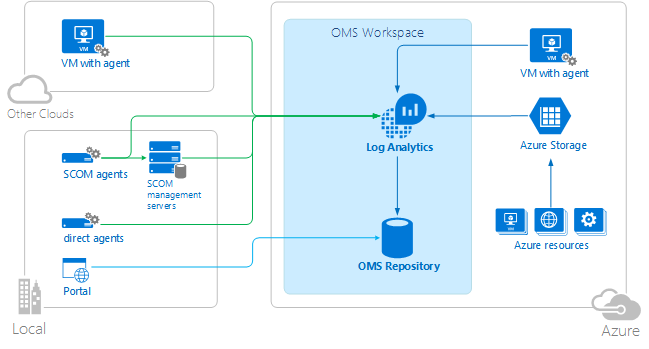
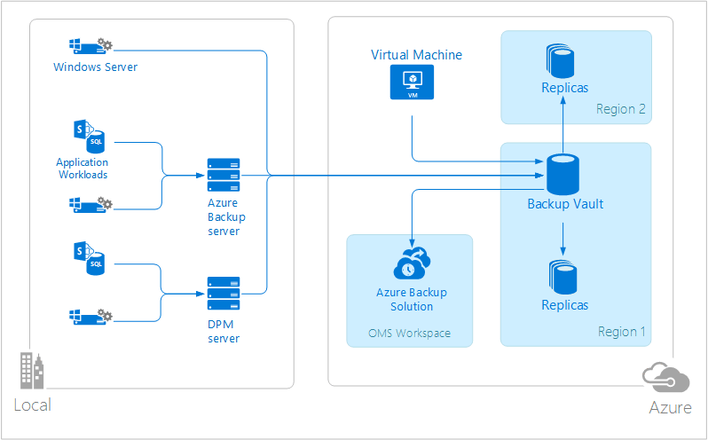
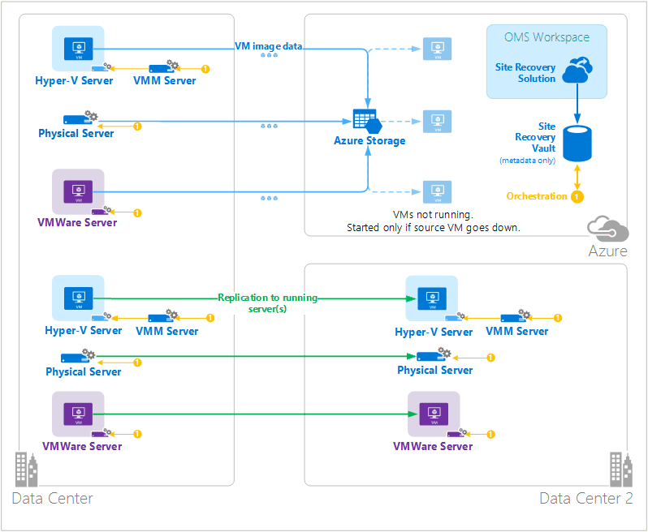
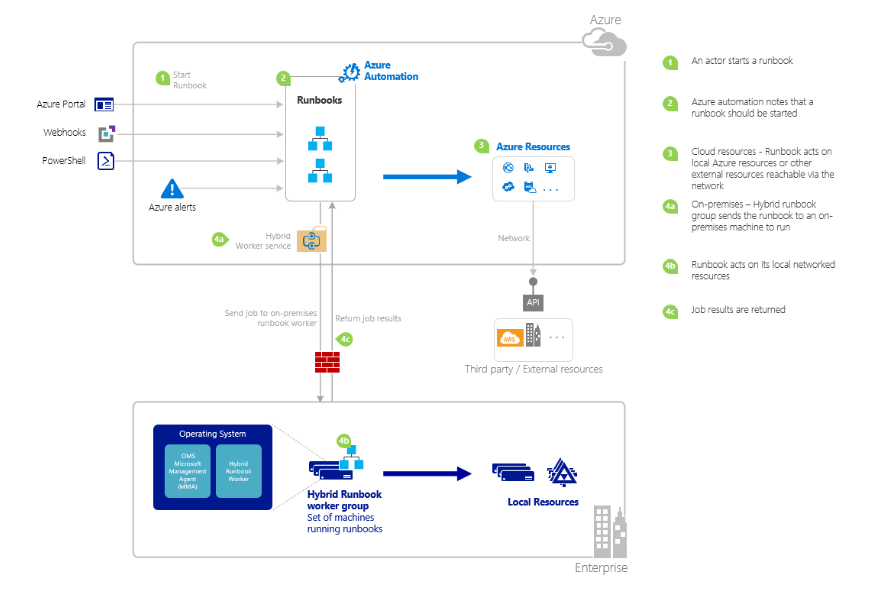

# OMS
Collection of cloud based services.

Manage on-prem & cloud environments

Below are a the list of services offered as part of OMS

-----
## Log Analytics

Collects data in the OMS repository (hosted on Azure)
Connected sources generate this data. 3 types of these sources :
- Agent installed on a system (Windows/Linux) connected to OMS.
- SCOM Mgmt group connected to Log Analytics.
- Azure Storage account that collects Azure Diagnostics data from a worker, web role or VM in Azure.

**Data Sources** - define the data collected from the connected sources.

**Solutions** - add functionality to OMS ( add these from OMS Solutions Gallery).



---- 
## Azure Automation
Runbooks executed on Azure.
Can access resources that are in Azure, in other cloud services or acccessible from the public Internet.
Hybrid Runbook Worker can be used in order to designate the execution of these Runbooks.

DSC configurations stored in Azure Automation can be directly applied to Azure VMs.
Other machines (Physical/Virtual) can request configurations from the Azure Automation DSC pull server.


----
## Azure BackUp

Stores protected data in a backup vault (located in a geographic region).
This data replicated within the same region or other region based on type of vault.

Three Scenarios :
 1. Windows machine with the Azure backup agent. Allow to backup files & folders from any windows machine.
 2. Leverage DPM or Azure backup server to backup files and folders in addition to application workloads e.g SQL, SharePoint etc and then replicate this to Azure backup vault.
 3. Azure VM extensions. Allow to backup Azure VMs to Azure backup vault.

 

----
## Azure Site Recovery
Service which orchestratte replication, failover, and failback of VMs & Physical servers.
Data replicated between Hyper-V hosts, VMware hypervisors, and Physical server in primary and secondary data center, or between the data ceter and Azure Storage.

Site Recovery stores metadata in vaults located in a particular geographic Azure region.
No replicated data is stored by the Site Recovery service.

Three fundamental scenarios :

 1. Replication of Hyper-V Vms. If VMM is in place then replication to secondar data center (over LAN) or Azure Storage (over Internet) possible. If there is no VMM then, replication to Azure Storage only.
 2. Replication of VMware VMs. Replicate VMware VMs to a secondary data center running VMWare (over InMage Scout Data channel) or Azure Storage (over site-to-site VPN or ExpressRoute or Internet).
 3. Replication of Physical Windows & Linux Servers. Replicate Physical servers to a secondary data center (over InMage Scout Data channel) or Azure Storage (over site-to-site VPN or ExpressRoute or Internet).

 

-----

 ## Azure Automation
 Runbooks to automate long running, error prone tasks in a Cloud environment.
 Automate Configuration Management using Azure Automation DSC.

 Trend :

Adopt Cloud Technologies
 - Integrate into different cloud providers.
 - Enable self service for IT offerings.
 - Enable DevOps culture.

Modern Management
 - Management as a service from the Cloud provider.
 - Automation solution across heterogeneous environments.
 - Automation at scale.

High level of the service :
- Runbook Automation
- PowerShell DSC
- Asset Store (Secure)

## Automation Account Overview

At start createa an Azure automation account, this account is the boundary for the automation resources ( runbooks, assets & configurations)/
Use these accounts to separate resources into logical environment for example - an automation account for PROD/ DEV & UAT environment.

Automation resources for each account are mapped to a single region.
Automation accounts can manage automation resources spanning across multiple regions.

Reason to create automation accounts in different regions could be if there are policies that require data & resources to be isolated to a specific region e.g Europe.


## Runbook Automation
Types of runboos are supported :

1. PowerShell Script
2. PowerShell workflow
3. Graphical PowerShell Workflow.

Note - Get the runbooks from **Runbook Gallery**.
Author runbooks locally or in the Azure portal.

#### **Authentication**
 - Certificate Based Authentication (ASM)
 - Azure AD Authentication (ARM)

At the moment when a new Automation account is created in the Azure portal, it auto creates the below :
 - **Run As account** ( new Service principal in AD, a certificate and assigns contributor RBAC). used to manage Resource Manager resources using runbook.
 - **Classic Run As account** by uploading a Management certificate, which will be use to manage ASM or classic resources using runbook.


## Demo - Graphical , PowerShell & Workflow Runbook
-----
Follow the below :

1. Create a new runbook.
2. Add activities (Write-Output)
3. Test the runbook.
4. Publish and start the runbook.  
5. Create variable asset to store the subscription id.
6. Add Authentication to manage Azure resources (using Connections).
7. Add activity to start a VM.
8. Add additional input parameters to the runbook.
9. Create a coniditional link.


-----

## RBAC + Azure Automation

RBAC allows segregation of duties within a team and allows to only grant the right amount of access to the Azure resources.
At any point you can create a custom role, which suits the needs of your team and assign users, groups and applications to the role.

Few of the builtin roles for AA :
- Owner - of the AutomationAccount.
- Contributor - Manage everything except modifu user's access to the AutomationAccount
- Reader - View all the resources of the AutomationAccount.
- Automation Operator - Perform Ops tasks only, helpful if you want to protect Azure automation resources from being viewed and modified.
- User access administrator - Allows to manage user access to AutomationAccount.

Note - Access granted only to the automation account level, not individual runbook.

-----
## Process Automation
Starting a Runbook :

 1. Azure portal
 2. PowerShell (Azure RM PowerShell module)
 3. Azure Automation API (Call the HTTP methods)
 4. WebHooks (Start runbook from a single HTTP request, pass only a single param)
 5. Respond to Azure alert
 6. From another runbook

 

-----
### PowerShell Code snippets

```PowerShell

# set the default network creds for the web request
[System.net.webrequest]::DefaultWebProxy.Credentials = [System.Net.CredentialCache]::DefaultNetworkCredentials

# Import the module
Import-Module -name AzureRM 

# Login to the Azure RM to set up the context
Login-AzureRmAccount

# See the context you are dropped in by default, the metadata used behind the scenes to auth to ARM
Get-AzureRMContext

# Check if you have multiple subscriptions
Get-AzureRMSubscription

# Time to set your Azure context, if not already set
Get-AzureRmSubscription | Out-GridView -PassThru | Set-AzureRmContext -Verbose

# List all the RBAC roles available in Azure AD
Get-AzureRMRoleDefinition
Get-AzureRMRoleDefinition -Name 'Automation Operator'

# See all the role assignments on the Automation account using scope
Get-AzureRMROleAssignment -scope "/subscriptions/4359ff68-61ce-430c-b885-4084a2656de7/resourceGroups/AzureAutomation/providers/Microsoft.Automation/automationAccounts/AzureAutomation1"

# See the role assignments on the Azure automation account 
Get-AzureRMROleAssignment -ResourceGroupName AzureAutomation -ResourceName AzureAutomation1 -ResourceType Microsoft.Automation/automationAccounts

# Don't see any account listted, then need to include classic administrator accounts 
Get-AzureRMROleAssignment -ResourceGroupName AzureAutomation -ResourceName AzureAutomation1 -ResourceType Microsoft.Automation/automationAccounts -IncludeClassicAdministrators

# Let's see all the Azure AD user in my default Azure AD directory.
Get-AzureRmADUser

#Assign owner role to a TestPSUser sign in account
New-AzureRmRoleAssignment -ObjectId  13eddffc-9841-46f2-876e-a3e0ba56e0f1 -ResourceGroupName AzureAutomation -ResourceName AzureAutomation1 -ResourceType Microsoft.Automation/automationAccounts -RoleDefinitionName 'Automation Operator' -Verbose

# Remove the role assignments
Remove-AzureRmRoleAssignment -ObjectId  13eddffc-9841-46f2-876e-a3e0ba56e0f1 -RoleDefinitionName "Automation Operator" -Scope "/subscriptions/4359ff68-61ce-430c-b885-4084a2656de7/resourceGroups/AzureAutomation/providers/Microsoft.Automation/automationAccounts/AzureAutomation1"

# See all the cmdlets available for the Azure Automation
Get-Command -module AzureRM.Automation

#List all the Runbooks in the account
Get-AzureRmAutomationRunbook -ResourceGroupName AzureAutomation -AutomationAccountName AzureAutomation1

# Start the Azure Automation Runbook
$runbookName = "MyFirstRunbook-PowerShell"
$ResourceGroup = "AzureAutomation"
$AutomationAcct = "AzureAutomation1"
$params = @{VMName='vm1';ResourceGroupName='CMDistrict_RG'}

$job = Start-AzureRmAutomationRunbook –AutomationAccountName $AutomationAcct -Name $runbookName -ResourceGroupName $ResourceGroup -Parameters  $params

$doLoop = $true
While ($doLoop) {
   $job = Get-AzureRmAutomationJob –AutomationAccountName $AutomationAcct -Id $job.JobId -ResourceGroupName $ResourceGroup
   $status = $job.Status
   $doLoop = (($status -ne "Completed") -and ($status -ne "Failed") -and ($status -ne "Suspended") -and ($status -ne "Stopped"))
}

$jobOutputs = Get-AzureRmAutomationJobOutput –AutomationAccountName $AutomationAcct -Id $job.JobId -ResourceGroupName $ResourceGroup –Stream Output

$jobOutputValues =$jobOutputs | % { Get-AzureRmAutomationJobOutputRecord -JobId $job.JobId -ResourceGroupName $ResourceGroup -AutomationAccountName $AutomationAcct -Id $PSItem.StreamRecordId}


# import the Script from my workstation
$runbookName = 'Test-PassingCreds'
@'
Workflow Test-PassingCreds
{
   param (
      [Parameter(Mandatory=$true)][PSCredential]$Credential
   )
    $credential.UserName
}
'@ | Out-File -FilePath $env:temp\Test-PassingCreds.ps1
Import-AzureRmAutomationRunbook -Path $env:temp\Test-PassingCreds.ps1 -Name $runbookName -Type PowerShellWorkflow -LogVerbose $True -ResourceGroupName $ResourceGroup -AutomationAccountName $AutomationAcct

# Publish the runbook
Publish-AzureRmAutomationRunbook -Name $runbookName -ResourceGroupName $ResourceGroup -AutomationAccountName $AutomationAcct -Verbose

# Create the Azure automation credential
$cred = New-Object -TypeName PSCredential -ArgumentList 'TestUser',$(ConvertTo-SecureString -String 'password' -AsPlainText -Force)
New-AzureRmAutomationCredential -Name automatedCredential -Value $cred -ResourceGroupName $ResourceGroup -AutomationAccountName $AutomationAcct -Verbose

# start the runbook and pass the object 
$params = @{Credential='AutomatedCredential'}
Start-AzureRmAutomationRunbook –AutomationAccountName $AutomationAcct -Name $runbookName -ResourceGroupName $ResourceGroup -Parameters  $params

# Remove the runbook
Remove-AzureRmAutomationRunbook -ResourceGroupName $ResourceGroup -AutomationAccountName $AutomationAcct -Name Test-Parameters -Force

#region WebHooks
<#
A webhook allows to start a particular runbook in Azure Automation through a single HTTP request.
Details of a webhook
Name -> name to identify the webhook.
URL -> Unique address (HTTP POST) tp start the runbook linked to the webhook.
Expiration Date -> Only set during the creation of webhook.
Enabled -> Can be set to be 'disabled' to disable webhook


#>

# create a webhook 
$webhookURL = 'https://s3events.azure-automation.net/webhooks?token=5tTTyC%2bVWwq0GMUYzf%2fr2objNJZeXTCne2hhW9Ly25s%3d'
$headers = @{"From"="user1@dexter.com";"Date"="$((get-date).tostring())"}

$CredentialName = @{Credential='AutomatedCredential'}
$body = ConvertTo-Json -InputObject $CredentialName 

$response = Invoke-RestMethod -Method Post -Uri $webhookURL -Headers $headers -Body $body
$jobid = ConvertFrom-Json $response 
#endregion